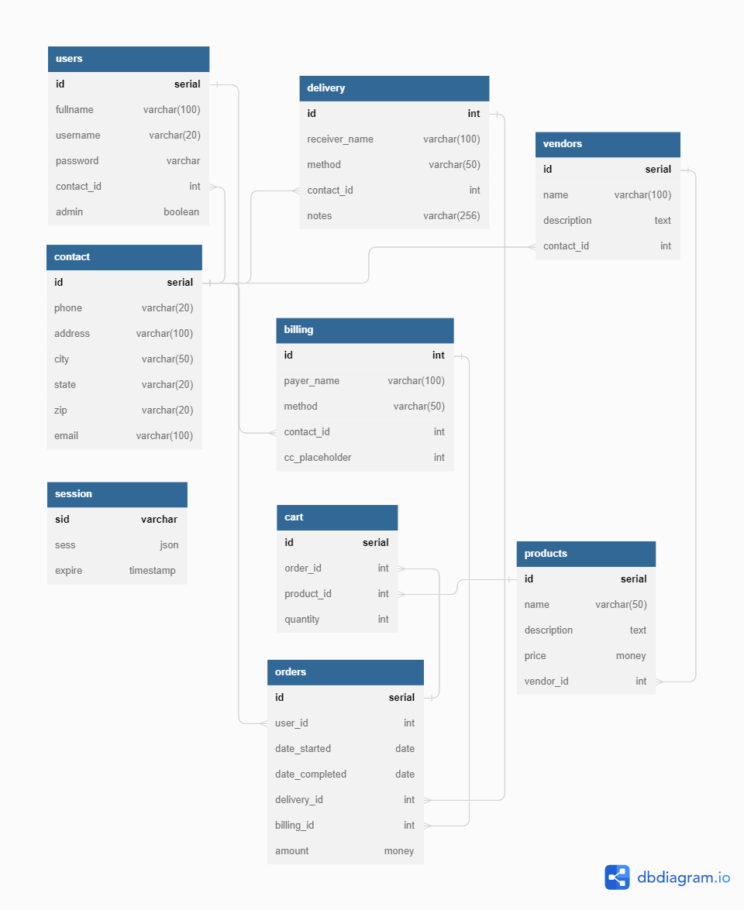

# E-Commerce API for Codecademy

This is an API for on online storefront that I created it as part of the Full-Stack Engineer path on [codecademy.com](https://www.codecademy.com/).

## Features

### API Endpoints

Basic API user endpoints for displaying products, adding them to a cart and checking out. Additional endpoints for admin editting users, products, vendors and ordrs.

### Authorization and Authentication

Uses Passport to authenticate the user identity locally. Also uses 3 levels of authorization: not logged in, logged in and admin. 

### Swagger/OpenAPI Documentation

The openapi.yml describers the api, and a swagger generated html API documentation is included in the swagger-html-client-generated folder.

### PostgreSQL Database 

The files used to create a Postgres database are included in the database_creation folder. Running dataApp.js will delete/drop all tables used in this project if they are already created, then it create the database tables, finially it populates the database with some examples. If you do not wish to pre-populate the database comment-out the two functions used to do that.

## Technologies used

- Javascript
- Node.js
- Express
- Passport
- passport-local
- node-postgres
- Connect PG Simple
- PostgreSQL
- Swagger
- dbdiagram.io
- Git
- GitHub

## Schema

Initial hand drawn sketch:

## Future Work

- Add simple views to help test and troubleshoot.
- Add images to products
- Add automated tests.