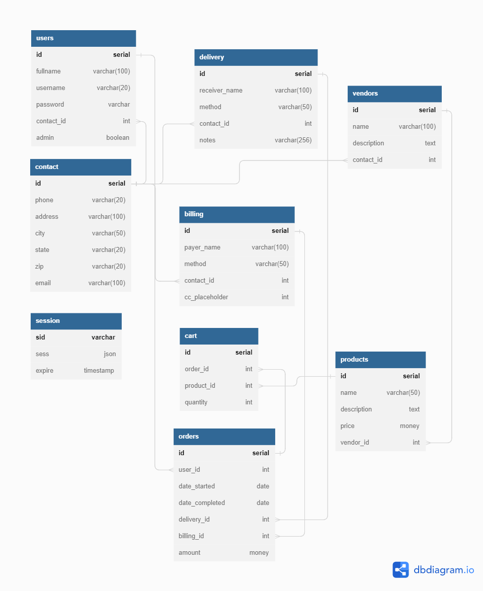

# A Fullstack E-Commerce App for Codecademy

This is an app for on online storefront that I created as part of the Full-Stack Engineer path on [codecademy.com](https://www.codecademy.com/).

## Features

### Backend
#### API Endpoints

Basic API user endpoints for displaying products, adding them to a cart and checking out. Additional endpoints for admin editing users, products, vendors and orders.

#### Authorization and Authentication

Uses Passport/jsonwebtoken to authenticate the user identity using the Passport JWT strategy. The API has an admin authorization level, but it is not implemented on the frontend. Originally, when I developed the backend, I had used the Passport-Local Strategy, but when I started developing the frontend application I could not test authorization on Chrome. This was because the backend and the frontend were running on different ports on the localhost. Chrome saw the API requests as cross-site and so it would not set the cookie that Express Session was sending from the backend to the frontend unless I set the session to "secure" which would have required an https protocol and TLS certification. There were a few alternative ways this could have been handled:

- Faking TLS certification on localhost during local development
- Building the static application each time I tested a change and hosting everything on the same port
- Setting up a reverse proxy server

Ultimately I chose JWT because of a combination of its general usefulness and relative simplicity. 

#### Swagger/OpenAPI Documentation

The openapi.yml describers the api, and a swagger generated html API documentation is included in the swagger-html-client-generated folder.

#### PostgreSQL Database 

The files used to create a Postgres database are included in the database_creation folder. Running node dataApp.js will delete/drop all tables used in this project if they are already created, then it create the database tables, finally it populates the database with some examples. If you do not wish to pre-populate the database comment-out the two functions used to do that. database connection information is store in environmental variables. When running this script locally I used a second .env file nested inside the subfolder to make it easier to arbitrarily change the database the tables are created on. This is how I created the database during deployment. The database was deployed using the ElephantSQL.com free tier.

### Frontend 
#### React SPA 

A functional (theoretically) e-commerce single page application built as a static React application interacting with the backend API.

#### Products page

A product area that displays products fetched from the database in a grid and paginated. Does not required authentication to interact with. When an item is clicked on the product's page is navigated to where the product can be added to cart.

#### Shopping Cart page

Displays the current shopping cart. If logged in, it synchronizes the the cart with the database. Posting any items in the cart locally to the database and fetching all items in the cart on the database.

#### Orders Page

Must be logged in to access this page. Displays the current user's previous orders. Orders can be clicked on to display details.

#### User Profile

A user profile page with contact info that can be updated/changed by the user.

#### Checkout

Checkout allows the user to set billing and delivery info or use information already on user profile. Uses Stripe (in test mode) to collect payment. After successful payment user is redirected to an order complete page.

## Deployment

I deployed this app at https://gentle-yoke-fish.cyclic.app using a combination of [Cyclic](https://cyclic.sh/) and [ElephantSQL](https://www.elephantsql.com/). Both services provide a free tier with no stated expiration. Cyclic deploys when commits on the master branch are pushed to github. The React application was built locally and uploaded to github. Cyclic will automatically run the build command, but since the react app is nested inside the backend app and has it's own package.json I am currently manually building it. Json Web Token encryption keys are stored on the Cyclic provided AWS S3 storage. The Postgres data is stored on an ElephantSQL database and Cyclic connects to it using environmental variables set on the Cyclic dashboard. 

## Technologies used

- Javascript
- Node.js
- Express
- Passport
- passport-JWT
- jsonwebtoken
- node-postgres
- PostgreSQL
- Swagger
- dbdiagram.io
- Git
- GitHub
- CSS
- React
- React Router
- Create React App
- Redux
- Redux Toolkit
- stripe.js/react-stripe.js
- AWS CLI
- AWS S3
- Cyclic
- ElephantQSL

## Schema

## Future Work

- Add images to products.
- Move images from file system to AWS S3
- Add Third party authorization 
- Add automated tests.